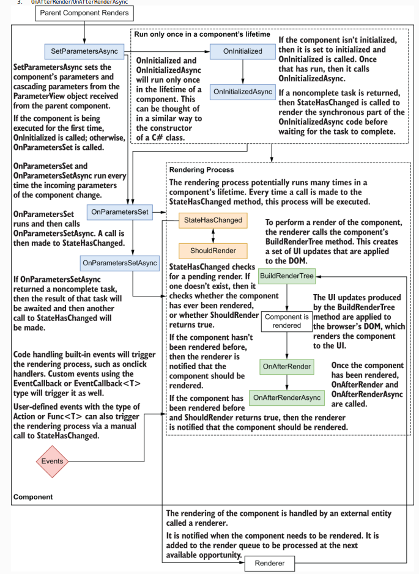
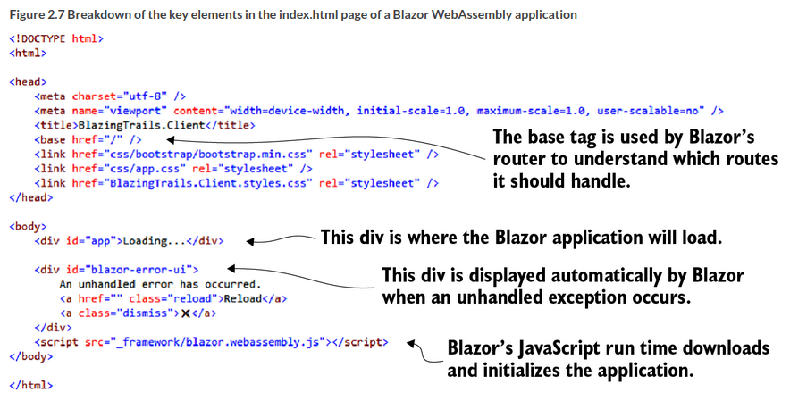

## Blazor
Browser + Razor: Also eine Razor page die im Browser geladen wird, anstatt auf dem Server.
### Struktur eines Blazor Components
  
Quelle: Blazor in Action - Manning

#### Abschnitt 1
In Abschnitt Eins kommen die Einstellungen/Konfig für das Komponent, wie z.b. die Seite wo es angezeigt wird, Dependency Injection oder using directives. Aber auch die Route (also /Home z.B.)
#### Abschnitt 2
In Abschnitt zwei wird der razor mix aus html und c# eingegeben. Am besten bleibt dieser bereich so frei von C# wie möglich.
#### Abschnitt 3
Abschnitt drei ist der Code bereich, wobei dieser besser in partial classes ausgelagert wird, der übersichtlichkeit halber.

### Client Side (webassembly model)
Um etwas neu zu aden oder funktionalität auf dem Client zu haben, braucht Blazor keinen Server. (Wobei es realistischer ist, dass es einen Call zum Server gibt).

### index.html
Die Index.html ist nicht nur die Startseite, sondern auch der Punkt in dem die Applikation gestartet wird. In index.html ist es möglich, eine "temporäre Seite" aufzubauen, während die richtige Seite noch lädt. Außerdem werden hier alle nicht gefangenen Exceptions in der Blazor eigenen UI ausgegeben. Ferner wird hier der Startpunkt für den Blazorclient über das Base Tag gesetzt. www.blazor.de/ wäre / als basetag und www.blazor.de/tutorial/ wäre /tutorial/. Hier nochmal mit mehr infos dazu:  
  
Quelle: Blazor in Action - Manning

### program.cs
Program.cs ist das Herz einer Blazor App. Von hier aus werden die Konfigurationen gesetzt und die IServiceCollection genutzt um per Dependency Injection die Klassen und Components mit den Services zu versorgen.

### app.razor
app.razor ist das "root-component". Das muss nicht unbedingt sein, weil in program.cs eine andere konfiguriert werden kann, aber meistens ist es so. In app.razor ist außerdem das Route-Component, was dafür verantwortlich ist, dass man über Seiten navigieren kann.

### wwwroot folder
Hier werden alle static files reingepackt, die mit der App mitgeliefert werden. Hier ist auch die index.html

### \_Imports.razor
Hier kann man die using statements speichern, die man häufig nutzt, sodass sie nicht in jede Klasse neu reingeschrieben werden müssen. Es ist auch möglich, das ganze auf die Ordner zu beschränken, in denen man arbeitet (und die darunter liegenden), indem eine imports.razor datei in den entsprechenden Ordner gelegt wird.

### verschiedene layouts
Um verschiedene Layouts für Seiten zu nutzen (also nicht das Layout was in app.razor im Router Component festgelegt wird), kann man am Anfang eines Components die @layout direktive nutzen (ähnlich wie @page).

### Files
Im Moment ist es in ASP Net noch nicht möglich JSON und multipart requests zu mischen. Dadurch muss ein seperater Request für Files an die API abgeschickt werden.

## Components
### Was sind Components?
Components sind quasi Front-end klassen. Ein Component könnte ein layout sein, aber auch ein Button oder ein Kalender. In Blazor ist es möglich durch Components modular zu arbeiten und sich selbst Bausteine für eine Website zu erstellen.

### state und methods
Die Daten die in einem Component sind, werden oft auch als __state__ bezeichnet. Dabei wird der state durch __methods__ manipuliert.

### component life cycle
Der Component Life Cycle besteht hauptsächlich aus 3 Methoden. 
__OnInitialized(/async)__ kann man sich als Construktor in c# klassen vorstellen. Es wird nur einmal am Anfang aufgerufen.  
__OnParameterSet(/async)__ wird jedes mal aufgerufen, wenn sich Parameter verändern (also auch nach dem Initialize). Sowohl hier als auch in OnInitialized wird StateHasChanged aufgerufen, was wiederum zum Renderer führt und dieser ruft "BuildRenderTree" auf.  
Nachdem das Component gerendered ist wird __OnAfterRender(/async)__ mit dem Parameter FirstRender aufgerufen. FirstRender ist beim ersten mal Rendern (also wenn auch OnInitialized läuft) true, ansonsten ist es false.  
Durch Async wird sich zwar nicht die Aufrufreihenfolge ändern, aber es könnte sein, dass z.B. OnAfterRender vor OnInitializedAsync fertig ist, weil alle async methoden in zwei Phasen gerendered werden. Der erste Aufruf ist Synchron -> Render und der zweite ist Asynchron -> Render. Das heißt (quasi) Async rendered einmal am Anfang und einmal am Ende.  
Um mehr als einen Render pro Methode zu erzeugen, muss manuell __StateHasChanged();__ aufgerufen werden.

  
Quelle: Blazor in Action - manning

### die geheime life cycle method (dispose)
Dispose ist optional und ist ähnlich wie die gleichnamige Methode in c#. Sie wird aufgerufen, wenn das Component nicht mehr gebraucht wird. Das ist vorallem wichtig, wenn das component sich in ein Event eingeschrieben hat und diese subscription beim löschen entfernen muss.

### parent and child
Es gibt zwei arten der Kommunikation zwischen Componenten:
__Parent to Child__ ist die Kommunikation von dem (Parent-)Component zu dem (Child-)Component in dem ersten drin. Diese Kommunikation läut über Parameter ab.
__Child to Parent__ ist die Kommunikation zu dem (Parent-)Component, in dem das (Child-)Component eingebettet ist. Sie läuft über Delegates (werden als Events bezeichnet) ab.

### Parameter
Um dem Component von außen Daten mitzugeben, muss im Component selbst das Attribut [Parameter] an das entsprechende Feld geschrieben werden. Seit net 6 ist es in kombination mit [EditorRequired] möglich, es in der IDE als required anzuzeigen. Im Parent-Component werden die Daten dann mithilfe von HTML Attributen weiter gegeben.

### Blazor DOM Events
Um vom Child zum Parent Component etwas durchzugeben muss das Parent ein Eventhandler erstellen, dieser wird an ein Delegate (also eine Referenz auf eine Funktion) im Child Component übergeben.  
Im Parentcomponent sieht das so aus:
```c#
<ChildComponent ChildDelegate="ParentEventHandler">
@code {
    private ChildStuff childStuff;
    private void ParentEventHandler(ChildStuff childStuff) 
        => this.childStuff = childStuff;
}
```
Im Childcomponent wird ein Delegate erstellt, welches aufgerufen wird, wenn das entsprechende DOMEvent von Blazor (wie z.B. @onclick) aufgerufen wird. Die Delegates sind EventCallback, damit beim Aufruf des ParentEventHandlers "StateHasChanged();" mit aufgerufen wird.  
Im Childcomponent sieht das so aus:
```c#
...snip...
    <button class="btn btn-primary"
        @onclick="
        @(async() => await OnSelected.InvokeAsync(ChildStuff)"> 
        CLICKME 
    </button>
...snip...

@code{
    [Parameter]
    public EventCallback<ChildStuff> OnSelected (get; set;)
}
```
Man könnte auch Action anstatt von EventCallback nutzen, aber es wären extra Zeilen code.  
[Offizielle Microsoft Docs](https://learn.microsoft.com/en-us/aspnet/core/blazor/components/event-handling?view=aspnetcore-6.0#event-argument-types)  
[Liste aller Blazor Events](https://developer.mozilla.org/en-US/docs/Web/Events)

### Parent-Child Communitcation bei uns im Code
Bei uns sieht das ganze dann im Childcomponent so aus:
```c#
[Parameter, EditorRequired]
public String Value {get; set;}

[Parameter]
public EventCallback<String> ValueChanged {get; set;}

private String BoundValue
{
    get => this.Value;
    set => ValueChanged.InvokeAsync(value);
}
```
So ist in BoundValue sowohl vom Parent to Child über den Value (bzw. BoundValue get) als auch Child to Parent über das EventCallback (bzw. BoundValue set) gegeben.

### @page, @using und @implements
__Page__ gibt die Seite an, über die auf das Component zugegriffen werden kann. Components mit @page werden oft auch Page(/Router)-Components genannt. 
__Using__ gibt die Importe an, die für dieses Component genutzt werden.
__Implements__ wird genutzt, um Interfaces zu erben.

### two way binding
@bind="_localVariable" bindet die lokale Variable im Codeblock an den input, der dem Component übergeben wird. Bei einer inputbox wäre das der Text, der eingegeben wird. Dieses binding geschieht jedoch nur, wenn das Textfeld fokus verliert (das default event ist onchange). Um die variable mit dem input zu "binden" muss man außerdem noch @bind:event="oninput" nutzen.

### Binding to Components
Um an Components zu binden, muss man nicht nur @bind schreiben sondern @bind-PARAMETERNAME. Am häufigsten sieht man das bei \<Textinputform @bind-Value=this.localValue>.

### @ref
@ref wird genutzt, um ein Component zu referenzieren.

## Begriffe
### Routing
Das ist der Pfad, den Blazor nimmt um auf das richtige Component zu kommen. Im Gegensatz zu multipage-Applikations wird das Routing bei Singlepage-Applikations (SAP) wie Blazor dem Browser Client überlassen.  
Das Router Component befindet sich in App.razor. Es wird angeführt mit \<Router AppAssembly>, außerdem gibt es dort noch \<Found> und \<NotFound>, wobei NotFound angezeigt wird, wenn die angefragte Route nicht existiert.

### route parameters
Route Parameters sind parameter die dem Pfad (der Route) mitgegeben werden können und somit flexibel gestaltet sind. Als Beispiel:
```c#
@inject NavigationManager NavManger

@code{
    private string searchterm = "Test";
    NavManager.NavigateTo($"/search/{searchTerm}");
}
```
Wenn NavManager aufgerufen wird, wird dynamisch searchterm in die Route eingesetzt. So wird das Component aus dem nächsten Block aufgerufen.
```c#
@page "/search/{SearchTerm}"

//snip

@code{
    [Parameter]
    public string SearchTerm {get; set;} = default!;
}
```
Das wichtige ist, dass der Route Parameter mit dem Parameter genau übereinstimmt.
Außerdem kann ein Component mehr als eine Route besitzen:  
```c#
@page "/search/{SearchTerm}"
@page "/search/{SearchTerm}/maxlength/{MaxLength:int}"

//snip

@code{
    [Parameter]
    public string SearchTerm {get; set;} = default!;
    [Parameter]
    public int? MaxLength {get; set;}
}
```
Zu beachten ist, dass der String der hier als Route Parameter MaxLength in das Component gegeben wird zu int umgewandelt wird, bevor er weiter benutzt wird. Dies geschieht durch :int.  
Weitere Constraints findet man [hier](https://learn.microsoft.com/en-us/aspnet/core/blazor/fundamentals/routing?view=aspnetcore-5.0).
Mit mehreren Route Parametern gibt es aber Probleme, weil dann immer die Reihenfolge zu beachten ist, oder es viele Routes geben muss, um alle Fälle abzudecken. Außerdem werden die links dadurch sehr lang.
Eine Alternative stellen query strings dar.

### query strings
Anstatt von Routes wie /search/uk/maxlength/10/maxtime/40 sehen query strings so aus: /search/uk?maxlength=10&maxtime=40  
Das hat den Vorteil, dass es nicht mehrere Routes geben muss und die Reihenfolge keine Rolle spielt.
Query strings werden mithilfe von NavManger.GetUriWithQueryParameters und SupplyParameterFromQuery. 
Das erste baut eine URI mit den entsprechenden Querystrings.
```c#
private void FilterSearchResults(){
    var uriWithQuerystring =
        NavManager.GetUriWithQueryParameters(
            new Dictionary<string, object?>(){
                [nameof(SearchPage.MaxLength)] =
                    this.maxLength == 0 ? null : this.maxLenght,
                [nameof(SearchPage.MaxTime)] =
                    this.maxTime == 0 ? null : this.maxTime
            }
        );

    NavManager.NavigateTo(uriWithQuerystring);
}
```
Das zweite ist ein Attribut, welches mit Parameter zusammen arbeitet: 
```c#
[Parameter, SupplyParameterFromQuery] public int? MaxLength{get; set;}
```
Das heisst, wenn in der URI durch einen query string maxlength=10 gesetzt wird, kann Blazor den Parameter MaxLength=10 setzen. Dann kann in OnParameterSet() das Suchergebnis durch einen Filter eingeschränkt werden.
(Randnotiz: OnParameterSet wird auch beim ersten mal mit aufgerufen, der Filter muss also nicht nochmal in OnInitialized stehen)

Den gesamten Code findet man hier:  
[Die gesamte Page](https://github.com/chrissainty/blazor-in-action/tree/main/chapter-04/BlazingTrails%20-%20Querystrings/BlazingTrails.Client/Features/Home)  
[Die Suchseite](https://github.com/chrissainty/blazor-in-action/blob/main/chapter-04/BlazingTrails%20-%20Querystrings/BlazingTrails.Client/Features/Home/SearchPage.razor)  
[Das Filtercomponent](https://github.com/chrissainty/blazor-in-action/blob/main/chapter-04/BlazingTrails%20-%20Querystrings/BlazingTrails.Client/Features/Home/SearchFilter.razor)


### life cycle methods
Das sind die vier event listener, die während des Life cycles (in der folgenden Reihenfolge bei React) aufgerufen werden.  
1. Rendering/mounting eines Components
2. Ein existierendes Component updaten
3. Alle errors abfangen, falls in 1. oder 2. was schief gegangen ist
4. unmounting/entfernen eines Components

### progressive web application (PWA)
PWA ist eine Mischung aus Web service, der html css und javascript nutzen kann und app. Sie kann wie eine Seite aufgerufen werden, hat aber trotzdem offline Funktionalitäten.

### static files
Static files sind files wie css, javascript oder bilddateien. Sie werden dem Client von der Blazor Seite direkt zur verfügung gestellt (als wären sie installiert?).

### React, Angular, Vue.js und Blazor
Was ist React und co? React und co sind "frontend" frameworks, die mittels eines virtuellen DOM das verändern von einzelnen UI komponenten ermöglichen.  
Was ist der Unterschied zwischen React und co und Blazor? Blazor benutzt hauptsächlich webassembly anstelle von javascript (bis auf die blazor.boot.json Datei)

### scoped vs global styles
global styles werden in der host page (meistens index.html) gespeichert. Diese gelten für alle Seiten und haben vorrang.
Scoped styles gelten nur für den Ordner in dem sie Vorkommen (und die darunter liegenden Ordner). Das heißt, wenn nur scoped styles verwendet werden, gibt es kein Problem.

### Null forgiving operator !
Der Operator ! am ende einer variable (x!) sagt der static compile analyse, dass hier keine null sein kann/ist. Sollte doch eine null vorkommen, wird in der runtime eine aussagekräftige Fehlermeldung geworfen. Das kann für Injections o.Ä. hilfreich sein, um Warnings zu entfernen.

### Javascript einbinden
Um Javascript einzubinden, muss das Component so heissen wie die js datei ohne das .js . Ausserdem sollte die js datei sich exportieren.
## Fragen
Kann man Page Components in ein anderes Component stecken und sie trotzdem über die Route aufrufen?
Sollten wir eine blob storage solution in der cloud nutzen?

## Notizen
Man sollte filenames in eigene Guids umformen, sodass sie nicht für böse zwecke genutzt werden können. Also wenn ein user seine PDF apple.pdf hochlädt, sollte die PDf nicht unter apple abgespeichert werden, sondern unter GUID.pdf.